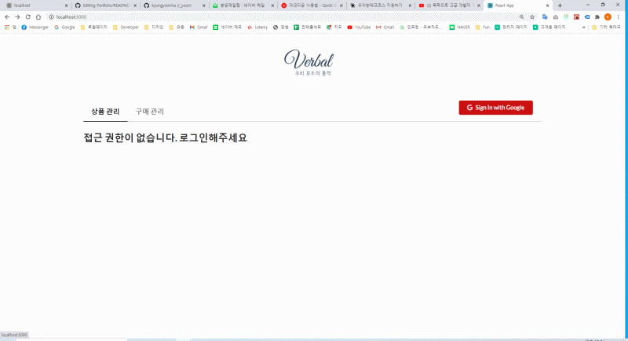

## ※ Personer Project [React + GoogleAPI + 카카오 알림톡]

### DESCRIPTION

-   구글 설문지 신규 작성시 확인 신규 알림톡 발송
-   구글 시트에 저장된 데이터로 확인 알림톡 발송 및 상태변경 기능
-   처음 가입시, 이력서 등록 완료시 등 각상황에 맞는 알림톡 발송 가능



### PROCEDURE:

```
// [루트 디렉토리에 .env 파일]
REACT_APP_VERIFIED_EMAIL = ['aaa@gmail.com']  // 관리자 구글 이메일
REACT_APP_GOOGLE_APIKEY = <구글 API KEY>
REACT_APP_GOOGLE_CLIENT_ID = <구글 ClientId KEY>
// 1. 구글 콘솔에서 clientID 생성
// 2. 구글시트 > 권한 추가 > clientId 추가 및 권한 부여
REACT_APP_KAKAOSEND_AUTHORIZATION  = <알림톡 APIKEY> // 오렌지 메시지 사용

$ git clone https://github.com/kyungyoonha/portfolio_react_kakaoMessageAPI.git
$ git install
$ cd portfolio_react_kakaoMessageAPI
$ npm start


```

### 구현 기능

-   Social login (Google login)
-   semantic-ui-react
-   redux
-   google Sheet API CRUD
-   pagination
-   modal
